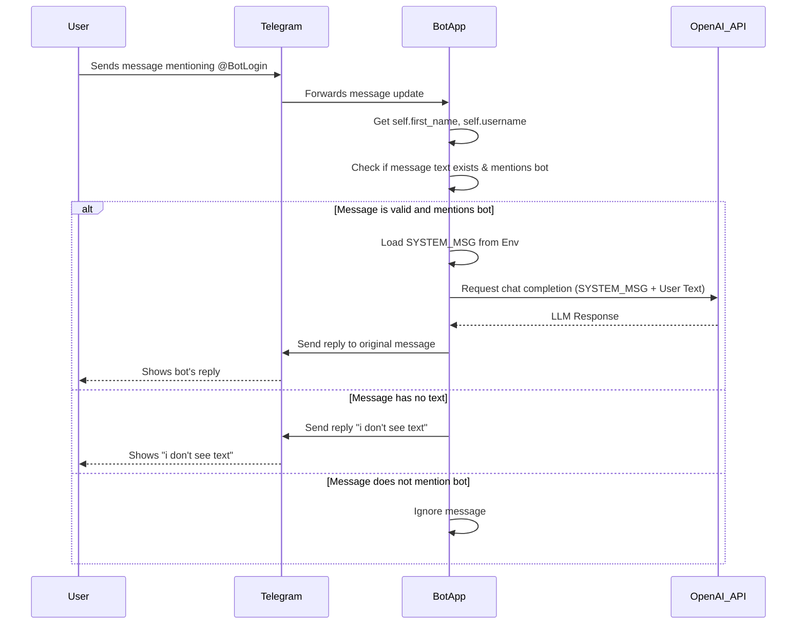

# Telegram Bot with OpenAI Integration

This project implements a Telegram bot that interacts with an OpenAI-compatible LLM. The bot responds to messages that mention it by name or username, forwarding the message text to the LLM and replying with the LLM's response. It includes basic logging for received messages and API interactions.

## Architecture

### Component Diagram

```mermaid
graph TD
    User -- Interacts via Telegram --> TelegramAPI[Telegram API]
    TelegramAPI -- Sends Update --> BotApp["Python Bot App (in Docker)"]
    BotApp -- Fetches Bot Info --> TelegramAPI
    BotApp -- Reads Env Vars --> HostOS[Host OS/Docker Env]
    BotApp -- Uses OpenAI Client --> OpenAI_API[OpenAI Compatible API]
    BotApp -- Sends Reply --> TelegramAPI

    subgraph Docker Container
        BotApp
    end

    subgraph CI/CD
        GitHubRepo[GitHub Repo: korjavin/pyExampleBot] -- Triggers --> GitHubActions[GitHub Actions]
        GitHubActions -- Builds & Pushes --> GHCR[GitHub Container Registry (ghcr.io)]
        GitHubActions -- Uses Secrets --> GitHubRepo
    end

    GHCR -- Image Pulled By --> DockerHost[Docker Host for Deployment]
    DockerHost -- Runs --> DockerContainer
```

### Sequence Diagram



## Environment Variables

The following environment variables are required to run the bot:

*   `TELEGRAM_BOT_TOKEN`: The token for your Telegram bot (obtained from BotFather).
*   `OPENAI_BASEURL`: The base URL of your OpenAI-compatible API.
*   `OPENAI_TOKEN`: The API key for your OpenAI-compatible API.
*   `SYSTEM_MSG`: The system message to be included in the LLM prompt.
*   `OPENAI_MODEL`: (Optional) The specific model to use for the OpenAI API call (defaults to `gpt-3.5-turbo`).

See `.env.example` for an example.

## Setup and Running

### Local Setup

1.  Clone the repository:

    ```bash
    git clone github.com/korjavin/pyExampleBot
    cd pyExampleBot
    ```

2.  Create a `.env` file based on `.env.example` and fill in the required environment variables.

3.  Install the dependencies:

    ```bash
    pip install -r requirements.txt
    ```

4.  Run the bot:

    ```bash
    python bot.py
    ```

### Docker Setup

1.  Build the Docker image:

    ```bash
    docker build -t ghcr.io/korjavin/pyExampleBot:latest .
    ```

2.  Run the Docker container, providing the environment variables:

    ```bash
    docker run -d \
        -e TELEGRAM_BOT_TOKEN="YOUR_TELEGRAM_BOT_TOKEN" \
        -e OPENAI_BASEURL="YOUR_OPENAI_BASEURL" \
        -e OPENAI_TOKEN="YOUR_OPENAI_TOKEN" \
        -e SYSTEM_MSG="You are a helpful assistant." \
        -e OPENAI_MODEL="gpt-3.5-turbo" \ # Optional: specify the model
        ghcr.io/korjavin/pyExampleBot:latest
    ```

## GitHub Actions

This project includes a GitHub Actions workflow (`.github/workflows/docker-publish.yml`) that automatically builds and pushes the Docker image to GitHub Container Registry (ghcr.io) whenever changes are pushed to the `main` branch.

To use this workflow, you need to:

1.  Enable the GitHub Actions workflow in your repository.
2.  Ensure that the `GITHUB_TOKEN` secret is available in your repository settings (this is automatically provided by GitHub).